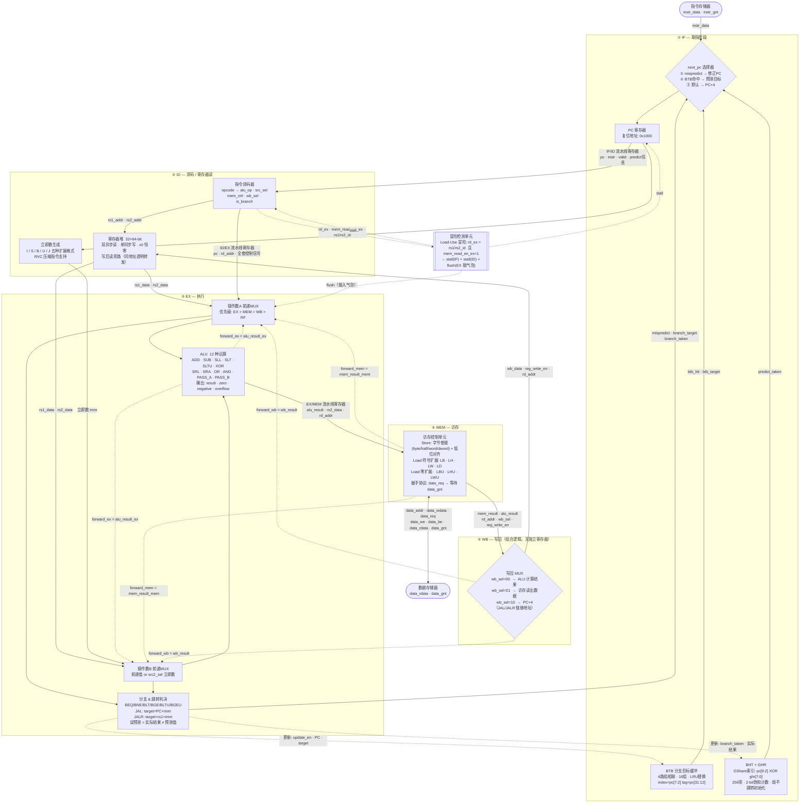

# Vega_cpu - 基于RISC-V的高性能CPU设计项目

本项目基于RISC-V指令集架构，设计一款高性能CPU并通过FPGA平台进行验证。

## 项目概述

五级流水线RISC-V CPU，支持RV32I/RV64I指令集，包含分支预测、数据旁路等优化技术。

## 项目结构

```
Vega_cpu/
├── docs/           # 项目文档
├── src/            # Verilog/VHDL源代码
├── test/           # 测试代码和TestBench
├── Project/        # Vivado相关文件
├── tools/          # 工具
├── CPU_DESIGN_REQUIREMENTS.md  # 需求文档
└── README.md       # 项目说明
```


## 技术要求

- 指令集：RISC-V RV32I/RV64I
- 架构：五级流水线（IF、ID、EX、MEM、WB）
- 语言：Verilog
- 平台：FPGA
- 工具：Vivado

## 性能目标

- 主频：≥ 50MHz
- LUT占用：＜ 5K
- 分支预测准确率：＞ 90%
- IPC：≥ 0.8

---

## CPU 架构图

### 1. 五级流水线模块架构与数据流图

展示各功能模块、流水线寄存器、数据前递路径、分支预测反馈及冒险控制信号的完整连接关系。

> **图例：** 实线箭头 `→` 为主数据/控制流；虚线箭头 `·→` 为旁路/反馈路径。WB 阶段为纯组合逻辑（无独立流水线寄存器）。ICache、DCache、CSR 单元、乘除法单元已实现但尚未接入主流水线。



---

### 2. 单条指令执行总流程图

展示一条指令从取指到写回的完整执行路径，包含分支预测、Load-Use 冒险检测、误预测冲刷及写回选择的完整决策逻辑。

> **说明：** 流水线各级并行执行，此图仅追踪单条指令视角；前递逻辑在 EX 阶段入口消除大多数 RAW 冒险，剩余 Load-Use 冒险由冒险检测单元通过气泡解决。

```mermaid
flowchart TD
    START(["上升时钟沿"])

    subgraph IF_F["① IF — 取指阶段"]
        F1["发出取指请求\ninstr_req=1\ninstr_addr = PC"]
        F2{"BTB 命中?"}
        F3{"BHT 预测跳转?"}
        F4["预测跳转\nnext_pc = BTB目标\npredict_taken=1\nGHR 左移补 1"]
        F5["顺序执行\nnext_pc = PC+4\npredict_taken=0\nGHR 左移补 0"]
        F6{"stall 信号?"}
        F7["输出气泡\ninstr=0 · valid=0\n（冒险等待）"]
        F8["锁存 IF/ID 寄存器\npc · instr · valid\npredict_taken · predict_target"]
    end

    subgraph ID_F["② ID — 译码阶段"]
        D1["指令译码\n生成控制信号\nalu_op · mem_ctrl · wb_sel\nalu_src1/src2_sel · is_branch"]
        D2["读寄存器堆\nrs1_data = RF[rs1_addr]\nrs2_data = RF[rs2_addr]"]
        D3["立即数符号扩展\n识别 I/S/B/U/J 格式"]
        D4{"Load-Use 冒险?\nrd_ex = rs1 或 rs2\n且 mem_read_en_ex = 1"}
        D5["插入气泡 + Stall\nflush ID/EX 寄存器\nstall IF · stall ID\n（下周期重新执行）"]
        D6["锁存 ID/EX 寄存器\nrs1/rs2_data · imm · rd_addr\npc · 全套控制信号"]
    end

    subgraph EX_F["③ EX — 执行阶段"]
        E1["前递逻辑选择操作数\nforward_sel: EX > MEM > WB > RF\noperand_B: 前递值 or 立即数"]
        E2["ALU 运算\nresult = f(operand_A, operand_B)\n计算 zero · negative · overflow 标志"]
        E3{"分支 / 跳转\n指令?"}
        E4["分支条件判断\nBEQ/BNE/BLT/BGE/BLTU/BGEU\nJAL: target=PC+imm\nJALR: target=rs1+imm"]
        E5{"误预测?\n实际结果 ≠ 预测值"}
        E6["冲刷流水线\nflush IF + flush ID\nPC ← 修正后目标地址\n更新 BHT 饱和计数器\n更新 BTB 目标表项"]
        E7["锁存 EX/MEM 寄存器\nalu_result · rs2_data · rd_addr\nbranch_taken · branch_target\nmispredict · 控制信号"]
    end

    subgraph MEM_F["④ MEM — 访存阶段"]
        M1{"访存类型?"}
        M2["Load\ndata_req=1 · data_we=0\n地址 = alu_result\n等待 data_gnt 握手"]
        M3["Load 数据扩展\n符号扩展: LB · LH · LW · LD\n零扩展:   LBU · LHU · LWU\n写入 mem_result"]
        M4["Store\ndata_req=1 · data_we=1\n写地址 = alu_result\n字节使能 + 数据低位对齐\n等待 data_gnt 握手"]
        M5["非访存指令\n透传 alu_result"]
        M6["锁存结果\nmem_result / alu_result\nrd_addr · wb_sel · reg_write_en"]
    end

    subgraph WB_F["⑤ WB — 写回阶段（组合逻辑）"]
        W1{"reg_write_en = 1?"}
        W2{"wb_sel 选择写回源"}
        W3["写入寄存器堆\nRF[rd] ← ALU 结果\n（R/I 型算术、逻辑、移位、LUI、AUIPC）"]
        W4["写入寄存器堆\nRF[rd] ← 访存读出数据\n（Load 指令）"]
        W5["写入寄存器堆\nRF[rd] ← PC+4\n（JAL / JALR 链接地址）"]
        W6["不写回 rd\n（Store · Branch · 无效指令）"]
    end

    DONE(["本周期完成\n进入下一时钟周期"])

    %% IF 阶段流程
    START --> F1 --> F2
    F2 -->|"命中"| F3
    F2 -->|"未命中"| F3
    F3 -->|"预测跳转"| F4 --> F6
    F3 -->|"预测不跳转"| F5 --> F6
    F6 -->|"是"| F7 --> D1
    F6 -->|"否"| F8 --> D1

    %% ID 阶段流程
    D1 --> D2 --> D3 --> D4
    D4 -->|"冒险 - 插入气泡"| D5 --> E1
    D4 -->|"无冒险"| D6 --> E1

    %% EX 阶段流程
    E1 --> E2 --> E3
    E3 -->|"是"| E4 --> E5
    E3 -->|"否"| E7
    E5 -->|"误预测"| E6 --> E7
    E5 -->|"预测正确"| E7

    %% MEM 阶段流程
    E7 --> M1
    M1 -->|"Load"| M2 --> M3 --> M6
    M1 -->|"Store"| M4 --> M6
    M1 -->|"其他"| M5 --> M6

    %% WB 阶段流程
    M6 --> W1
    W1 -->|"否"| W6 --> DONE
    W1 -->|"是"| W2
    W2 -->|"00"| W3 --> DONE
    W2 -->|"01"| W4 --> DONE
    W2 -->|"10"| W5 --> DONE
```

